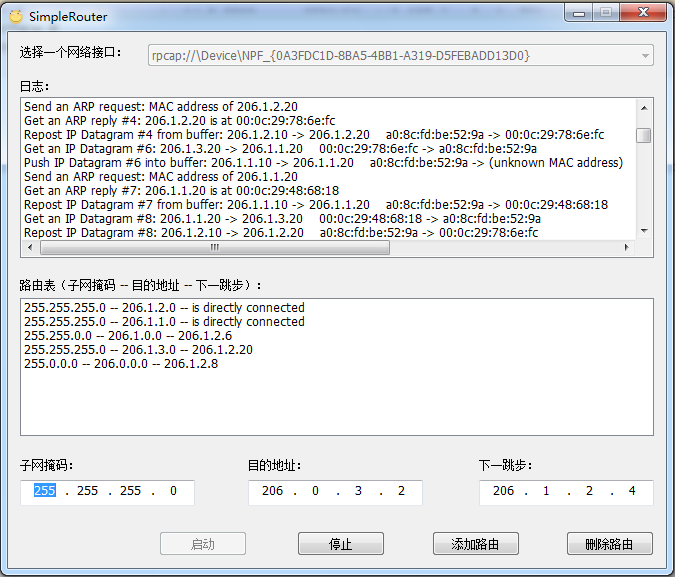

# simple-router
网络技术与应用编程作业 #3 —— 实现简单的路由程序

已完成所有要求的功能并通过验收。可能还会有一些bug，有问题请多指教。

最终得分：100/100

## 编程环境

- Visual Studio 2015 (for C++, MFC应用程序)
  - 这里使用的Release，编译选项的运行库设置最好采用「多线程调试 (/MTd)」，否则可能会崩
- WinPcap 开发包 v4.1.2

## 界面截图

## 功能说明

- 仅支持以下的网络拓扑图（打圈处为本程序所在的位置）

  

- 采用单网卡双IP地址方案

- 显示转发IP数据报、ARP数据包的日志

- 仅支持静态路由，支持最长前缀匹配

- 有数据包缓存区

- 可以通过 `ping` 命令和 `tracert` 命令的测试，输出内容与采用标准路由器或路由软件的输出内容（除延迟外）完全相同